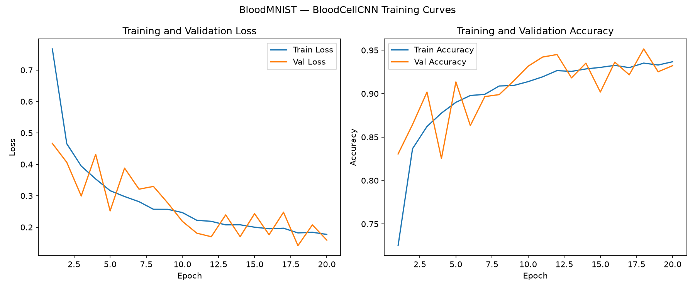
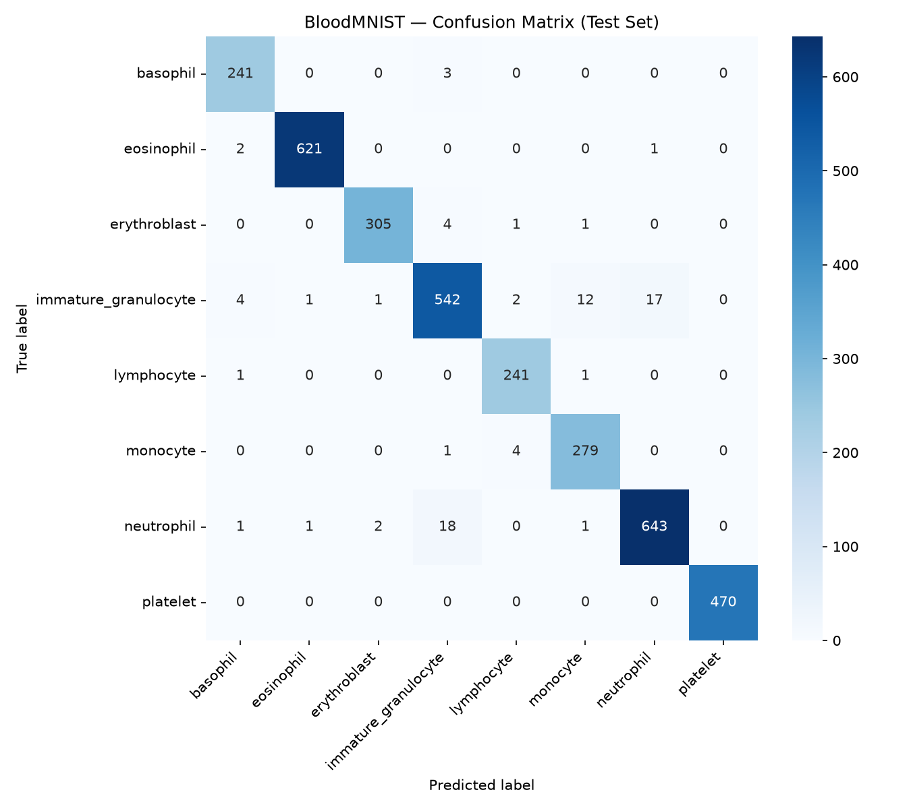

# BloodMNIST


A convolutional neural network, built in PyTorch, that classifies microscopic blood cell images into 8 cell types.

**Test accuracy: 97%** | **Macro F1: 0.97** — see [`results.md`](results.md) for training curves, the confusion matrix, and a full record of what was tried.

## Motivation

This project explores multi-class image classification in a biomedical context, part of a broader interest in applying machine learning to molecular and biological data. Peripheral blood cell classification is a well-established task in hematology: an automatic recognition system that reliably separates the 8 normal cell types is a real building block toward tools that support (not replace) manual differential counts. It's also a good testbed for practicing the full pipeline end to end — data loading, architecture design under real resolution/compute constraints, class-imbalance handling, and honest, iterative evaluation of what actually moves a model's performance versus what doesn't.

## Dataset

- **Source:** BloodMNIST, distributed via the [MedMNIST v2](https://medmnist.com/) benchmark collection (Yang et al., 2023, *Scientific Data*), built from peripheral blood cell microscopy images originally published by Acevedo et al. (2020, *Data in Brief*)
- **Classes (8):** basophil, eosinophil, erythroblast, immature granulocyte (myelocytes, metamyelocytes, promyelocytes), lymphocyte, monocyte, neutrophil, platelet
- **Collected from:** healthy donors, free of infection, hematologic, or oncologic disease, and not undergoing pharmacologic treatment at the time of collection
- **Split:** 11,959 train / 1,712 val / 3,421 test (17,092 total)
- **Resolution:** 64×64 RGB (MedMNIST+; see [Architecture](#architecture) for why 28×28 wasn't sufficient)
- **Class imbalance:** 2.74x between the largest class (neutrophil) and smallest (lymphocyte) — see `assets/class_distribution.png`

Per MedMNIST's own documentation, this dataset is **not intended for clinical use**.

## Architecture

A 3-layer CNN (no pretrained weights):

```
Input (3×64×64)
  → Conv2d(3→32, k=3, pad=1) → BatchNorm2d → ReLU → MaxPool(2×2)   [64→32]
  → Conv2d(32→64, k=3, pad=1) → BatchNorm2d → ReLU → MaxPool(2×2)  [32→16]
  → Conv2d(64→128, k=3, pad=1) → BatchNorm2d → ReLU → MaxPool(2×2) [16→8]
  → Flatten (128×8×8 = 8,192)
  → Dropout(p=0.3)
  → Linear(8192→512) → ReLU
  → Linear(512→8)
```

Trained with Adam (lr=0.001, reduced by 10x on validation-loss plateau via `ReduceLROnPlateau`, patience=3), a class-weighted cross-entropy loss (inverse-frequency weighting to correct the 2.74x imbalance), batch size 100, for 20 epochs, with random flip/rotation augmentation on the training set. Full details in [`model.py`](model.py) and [`train.py`](train.py).

Kernel size (3) and padding are deliberate choices, not defaults — see [Repository structure](#repository-structure) note below and `results.md` for the reasoning.

## Results

| Metric | Value |
|---|---|
| Test accuracy | **97%** |
| Macro F1 | 0.9798 |
| Weighted F1 | 0.9792 |
| Weakest class (immature granulocyte) F1 | 0.9483 |
| Strongest class (platelet) F1 | 1.0000 |





Every class scores above 0.94 F1. The only meaningful residual confusion is between immature granulocyte and neutrophil — 15 and 16 misclassifications respectively, out of nearly 600 and 666 test samples. This is a biologically coherent error: immature granulocytes are the direct developmental precursor to mature neutrophils, so morphological overlap between the two is expected even for a well-trained classifier. Full experiment history, including two dead ends and one confirmed hypothesis, is in [`results.md`](results.md).

## Limitations

This model is trained and evaluated exclusively on cells from healthy donors, meaning it has no exposure to pathological cell morphology (e.g., leukemic blasts) and should not be expected to generalize to disease detection. Per MedMNIST's own documentation, **this dataset is not intended for clinical use**, and this model is not validated for any diagnostic purpose. The remaining immature-granulocyte/neutrophil confusion, while modest, would matter in a real screening context, since these developmental stages carry different clinical significance.

## Setup

```
git clone https://github.com/jenniferestigene/bloodmnist.git
cd bloodmnist
python3 -m venv venv
source venv/bin/activate        # <- Mac, Windows -> : venv\Scripts\activate
pip install -r requirements.txt
```

BloodMNIST downloads automatically via the `medmnist` package on first run — no manual dataset download needed.

## Usage

```
python dataset.py             # builds .npy tensors + assets/class_distribution.png
python train.py               # trains the model, saves saved_model.pth + training_log.csv
python visualize_training.py  # builds assets/training_curves.png from the training log
python evaluate.py            # evaluates on the test set, builds assets/confusion_matrix.png + classification_report.txt
```

`train.py` automatically uses a GPU if one is available (`torch.cuda.is_available()`), and falls back to CPU otherwise — the same code runs unmodified locally or on a GPU-backed environment like Google Colab.

## Future Work

- **Higher resolution (128×128 or 224×224)**, to see whether the remaining immature-granulocyte/neutrophil confusion continues to shrink with more spatial detail, or whether 64×64 has already captured the relevant morphological signal
- **Targeted augmentation or loss adjustments** aimed specifically at the immature granulocyte/neutrophil boundary, rather than global class reweighting
- **Bias/fairness analysis** — this dataset and evaluation don't cover variation across donor demographics or sample preparation conditions

## Repository structure

```
bloodmnist/
├── assets/
│   ├── class_distribution.png
│   ├── training_curves.png
│   └── confusion_matrix.png
└── README.md
├── classification_report.txt
├── dataset.py               # raw images → .npy tensors + class_distribution.png
├── evaluate.py               # evaluation + per-class metrics + confusion matrix
├── model.py                 # CNN architecture (nn.Module)
├── requirements.txt
├── train.py                 # training loop, weighted loss, LR scheduler, writes training_log.csv
├── training_log.csv         # metrics from the reported run
├── results.md                # training curves, metrics, full experiment log
├── visualize_training.py    # builds training_curves.png from the log

```