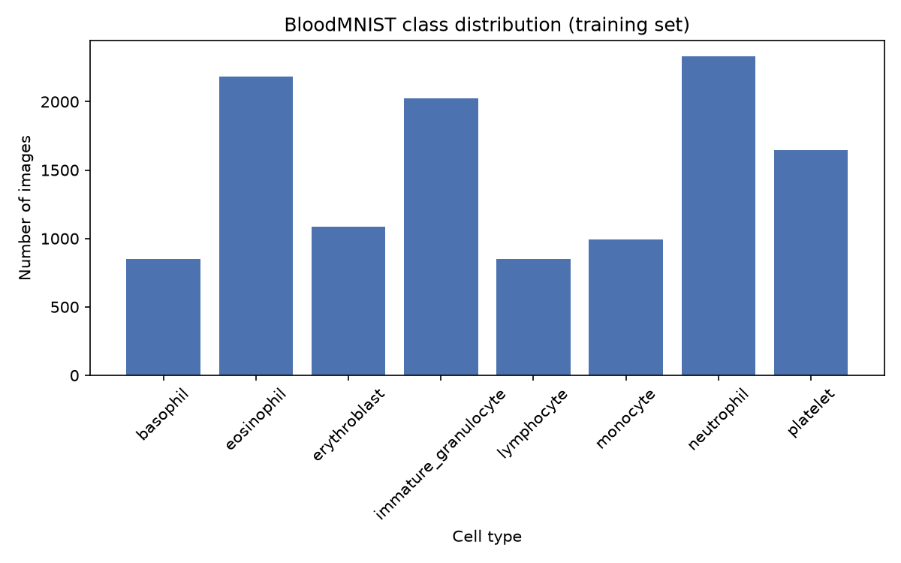

# Results

## Final metrics (64×64, weighted loss, LR scheduler, 20 epochs)

| Class | Precision | Recall | F1 | Support |
|---|---|---|---|---|
| basophil | 0.9526 | 0.9877 | 0.9698 | 244 |
| eosinophil | 0.9968 | 0.9968 | 0.9968 | 624 |
| erythroblast | 0.9841 | 0.9936 | 0.9888 | 311 |
| immature_granulocyte | 0.9626 | 0.9344 | 0.9483 | 579 |
| lymphocyte | 0.9837 | 0.9959 | 0.9898 | 243 |
| monocyte | 0.9621 | 0.9824 | 0.9721 | 284 |
| neutrophil | 0.9758 | 0.9700 | 0.9729 | 666 |
| platelet | 1.0000 | 1.0000 | 1.0000 | 470 |
| **accuracy** | | | **0.97** | 3421 |
| macro avg | 0.9772 | 0.9826 | 0.9798 | 3421 |
| weighted avg | 0.9793 | 0.9792 | 0.9792 | 3421 |

## Training curves

The learning rate scheduler (`ReduceLROnPlateau`, patience=3, factor=0.1) triggered once, around epoch 12–13, in response to validation loss plateauing/oscillating. Validation loss and accuracy both stabilize noticeably after the drop, with far less epoch-to-epoch noise than the pre-drop phase.

## Confusion matrix

The diagonal is dominant across all 8 classes. The only meaningful off-diagonal concentration is between immature_granulocyte and neutrophil (15 and 16 misclassifications respectively). This pairing is biologically expected: immature granulocytes (myelocytes, metamyelocytes, promyelocytes) are the direct developmental precursors to mature neutrophils, so morphological overlap between the two is a real property of the underlying biology, not an artifact of the model.

## Class distribution

2.74x imbalance between the largest class (neutrophil, 2,330 images) and smallest (lymphocyte, 849 images) in the training set. This motivated the inverse-frequency class weighting used in the final loss function (see `compute_class_weights()` in `train.py`).

## What was tried

This model went through five sequential experiments, each changing exactly one variable from the previous best configuration, to keep the cause of any change in performance identifiable.

**1. Baseline pipeline (28×28, weighted loss, no scheduler).**
Established the full dataset → model → train → evaluate pipeline at BloodMNIST's default 28×28 resolution, with inverse-frequency class weighting to correct the 2.74x imbalance. Along the way, two real bugs were caught and fixed: a training-log indentation error (validation/logging code sat outside the epoch loop, so only the final epoch's metrics were ever recorded) and a stale-checkpoint bug (an old 1-epoch sanity-check `saved_model.pth` was evaluated instead of the properly trained 20-epoch weights, producing a misleadingly low 77% test accuracy before the correct file was identified).

**2. Added a learning-rate scheduler (28×28).**
`ReduceLROnPlateau` (factor=0.1, patience=3) was added after observing that validation loss oscillated noticeably in later epochs of the baseline run. Result: **95.88% test accuracy**. The training log shows the scheduler triggered a single 10x lr drop around epoch 12, after which validation loss dropped smoothly and monotonically from ~0.35 to ~0.11, with the earlier epoch-to-epoch noise essentially eliminated, which is direct evidence the scheduler was addressing the specific instability it was meant to.

**3. Extended training to 30 epochs (28×28).**
Tested whether the model was simply undertrained. Result: **95.21% test accuracy**: no improvement over the 20-epoch run. The learning rate dropped once (at epoch 8 this time, versus epoch 12 in the previous run, expected run-to-run variation from stochastic training) and never dropped again; validation loss oscillated in a tight, flat band (0.128–0.148) for the remaining 22 epochs with no further downward trend. Conclusion: the model had genuinely plateaued at this resolution and learning-rate schedule; additional epochs were not the lever to pull. Reverted to 20 epochs.

**4. Unweighted loss, as a diagnostic (28×28).**
Immature_granulocyte was the worst-performing class in every run despite being the third-largest (579 samples). Hypothesis: since inverse-frequency weighting downweights common classes, it might have been actively suppressing this specific hard-but-common class. Tested by removing weighting entirely (plain `CrossEntropyLoss`). Result: **86.64% test accuracy** — immature_granulocyte's F1 dropped further, from 0.90 to 0.68, and basophil (F1 0.94 → 0.75) and monocyte precision (0.93 → 0.49) also collapsed. The hypothesis was wrong: weighting was not suppressing the hard classes, it was stabilizing them. Weighting was restored.

**5. Increased resolution to 64×64.**
With imbalance and training-schedule levers exhausted, resolution was the remaining candidate, immature_granulocyte, monocyte, and neutrophil are distinguished by fine nuclear shape detail that 28×28 downsampling plausibly loses. Required recalculating the architecture's flattened dimension by hand (128×8×8 = 8,192 at 64×64, versus 128×3×3 = 1,152 at 28×28) since the same three-conv-layer, three-maxpool architecture produces a different spatial output size at a different input resolution. Result: **97% test accuracy** — the largest single improvement of any experiment. Immature_granulocyte's F1 rose from 0.9033 to 0.9483, and the specific confusion the earlier resolution had shown most strongly (101 immature_granulocyte → monocyte misclassifications at 28×28) nearly disappeared (10 at 64×64). This is the current final model.

## Known limitations

- Trained and evaluated exclusively on healthy-donor cells; no exposure to pathological morphology (e.g., leukemic blasts), so no claim of diagnostic or disease-detection capability.
- Per MedMNIST's own documentation, this dataset is not intended for clinical use, and this model has not been validated for any clinical or diagnostic purpose.
- Remaining confusion between immature_granulocyte and neutrophil, while small (15–16 misclassifications out of ~600–666 samples per class), reflects a real, clinically meaningful distinction between developmental stages that the model does not fully resolve.
- No bias/fairness analysis has been performed across donor demographics or sample preparation conditions, since the dataset does not include this metadata.